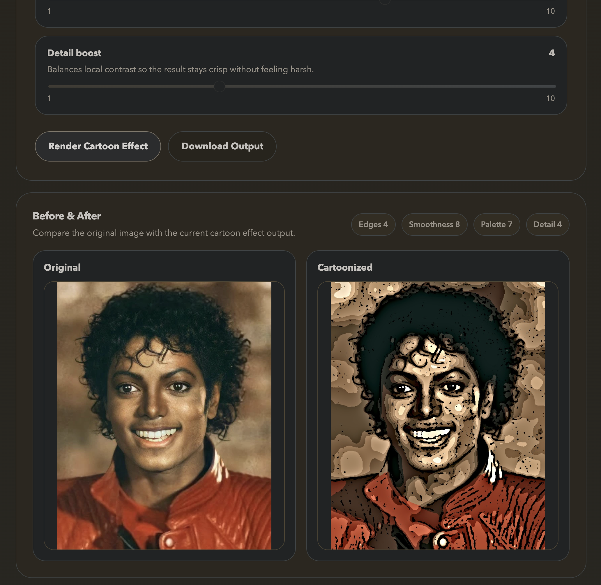
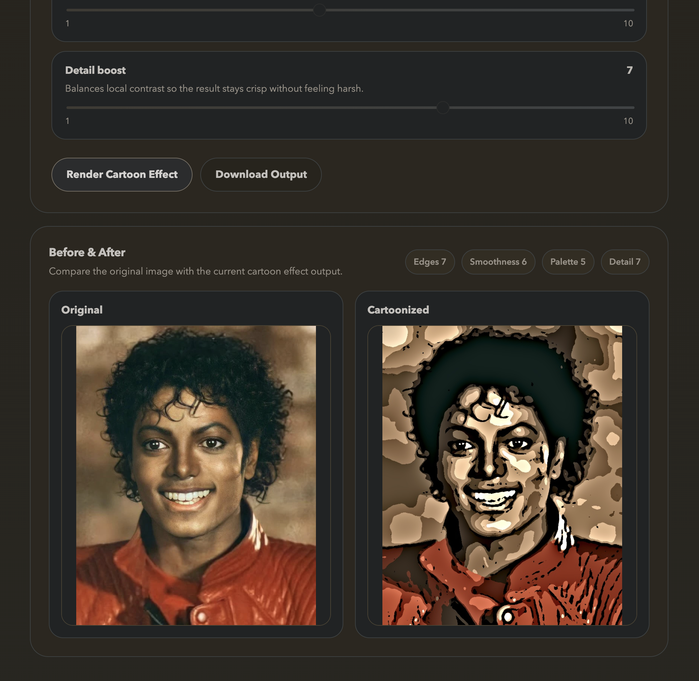

# Final Project

## Description
This project is a web-based image processing application that takes user-uploaded images and applies a "cartoonish" effect. The image is taken and processed by OpenCV to produce bold colors with strong outlines, displaying the before and after images side by side.

## Design
I am using some sources listed below along with the help of Anthropic's Claude to perfect the code. The sources I am using are to help me understand how the cartoon effect works, as well as how to use OpenCV to process the image. I used Claude to assist in the brainstorming process for project ideas and working out different approaches, comparing the difficulty and outcome of each possible project.

I plan to use Python with Flask for the web framework and OpenCV for image processing. My goal is to make the cartoon effect by using bilateral filtering and adaptive thresholding. Bilateral filtering will allow me to smooth the colors while preserving the edges, and the adaptive thresholding will allow me to create the bold outlines. The outcome of each process will then be combined using a bitwise operation that merges the two processed images, completing the final image of smooth colors and bold outlines.

Helpful Resources:
- [Building an Image Cartoonization Web App with Python - Towards Data Science](https://towardsdatascience.com/building-an-image-cartoonization-web-app-with-python-382c7c143b0d/)
- [Cartooning an Image using OpenCV - GeeksForGeeks](https://www.geeksforgeeks.org/blogs/cartooning-an-image-using-opencv-python/)

## Test

The application was tested locally via Docker on localhost:8080. An image was uploaded and the cartoon effect was applied successfully, displaying the original and cartoonized images side by side.

The sliders were tested with multiple configurations to verify that each parameter produces a visible difference in the output. In the first test, default slider values were used (Edges 7, Smoothness 6, Palette 5, Detail 7), producing a bold cartoon effect with flat color regions and strong outlines. In the second test, the sliders were adjusted to lower edge and detail values (Edges 4, Smoothness 8, Palette 7, Detail 4), which produced a softer result with more color variation and finer outlines. Both tests confirmed the sliders work correctly and affect the output as expected.

The download button was also tested and successfully saved the cartoonized image to disk.

